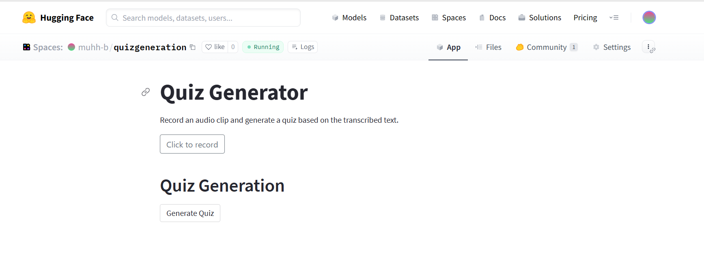

Check out the configuration reference at https://huggingface.co/docs/hub/spaces-config-reference

# Automated Audio Transcription and Quiz Generation

This project aims to automate the process of audio transcription and quiz generation based on the transcribed text. It utilizes the Whisper model for audio transcription, a spell checker model for correcting spelling errors, the Google BARD API for quiz generation, and the Google Forms API for creating quizzes.

## project quick demo


https://github.com/muhh-b/quizgeneration/assets/69880179/0bab6fb9-ac2f-4954-8bf9-09676ac4bc73


## HUGGING FACE SPACES UI




## Features

- Audio Transcription: Convert audio files into text using the Whisper model.
- Spelling Correction: Correct spelling errors in the transcribed text using a spell checker model.
- Quiz Generation: Generate quizzes based on the transcribed text using the Google BARD API.
- Google Forms Integration: Create quizzes using the generated quiz questions and the Google Forms API.
- Deployment: Deployed on Hugging Face Spaces using Streamlit.


## Dependencies

To run this project, you need to have the following dependencies installed:

- Transformers
- Torch
- Whisper
- Streamlit
- Streamlit-audiorecorder
- Apiclient
- Httplib2
- Oauth2client
- Bardapi
- Ffmpeg
- Ffmpeg-python
- Google-api-python-client
- Google-auth
- Openai-whisper
- Google-auth-oauthlib
- Google-auth-httplib2
- Sentencepiece

You can install these dependencies by running the following command:
```bash
pip install -r requirements.txt
```

## Usage

1. Enable the Google Forms API in your Google Cloud project.
2. Authorize credentials for a desktop application and save the downloaded `credentials.json` file in your working directory.
3. Run the `app.py` file to start the application.
4. Use the application interface to transcribe audio files, correct spelling errors, generate quizzes, and create quizzes using the Google Forms API.

## Workflow

1. The audio file is transcribed using the Whisper model, generating the initial text.
2. The initial text is passed through a spell checker model to correct any spelling errors.
3. The corrected text is used as input to the Google BARD API to generate quiz questions.
4. The quiz questions are integrated with the Google Forms API to create quizzes.
5. The created quizzes can be accessed and shared through the Google Forms platform.


## Acknowledgments

Special thanks to Mr. Mahmoudi, our advanced learning teacher, for providing guidance and support throughout the project.

## References

[Bard API](https://github.com/dsdanielpark/Bard-API)
[Google Forms DOCS](https://developers.google.com/forms/api/quickstart/python)
[Streamlit](https://docs.streamlit.io/)


